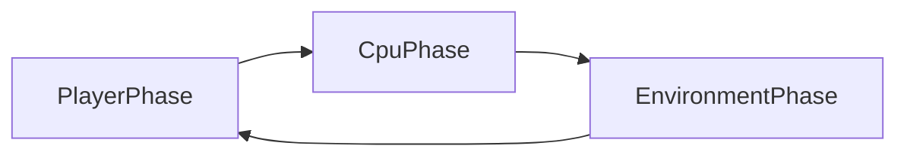

# Board game (vodalus) — product requirements

## 1. Problem and vision

Vodalus needs a **solo tactical board** experience: a small grid, discrete **phased** turns, one human vs one CPU opponent, with an **environmental** layer that creates pressure independent of the enemy. The experience lives as a normal site page at `pages/board.html`, using the same shell as other pages (sidebar, shared styles).

[`indev/board.html`](../../indev/board.html) hosts **in-development spikes** (grid addressing, shop UX experiments, and historically Conway’s Game of Life) to validate that a **large DOM grid** scales in JavaScript. The **shipped game must not resemble Conway** or retain spike-only mechanics; final boards are **8×8 to 12×12**. Conway or other obsolete spikes stay **archived** under `indev/` (or an equivalently obvious reference location) for reuse reference, not as product mechanics.

## 2. User stories

**Authenticated (session cookie present, same identity model as `/api/me`):**

- Start a new procedural game; receive a board with valid starting layout.
- Complete a **player phase**, then observe **CPU** and **environment** phases resolve in order.
- Win when the **enemy tower** is eliminated from play, or lose when the **player tower** is eliminated (see §4.1 for tower definition and elimination).
- **Stop** and **resume** the same in-progress game on **another device** (server-backed state).
- Optionally abandon a run (no requirement to keep completed-run history for meta progression).

**Not logged in:**

- See login UI with a **guest** option.
- As **guest**: play entirely **client-side**; **no** server persistence, **no** cross-device resume, **no** server-side logging of guest play.

## 3. Core loop (time model)

Each **round** consists of three phases in fixed order: **player → CPU → environment**, then control returns to the player for the next round unless the game has ended.

## 4. Functional requirements

### 4.1 Board, territory, and towers

- Grid dimensions are **procedurally chosen per new game** within **8×8 and 12×12** inclusive.
- **No implicit empty cells at generation**: every cell has a **base terrain** type assigned during procedural generation (e.g. grass, sea, mountain, river — exact taxonomy is implementation detail). Player-facing **tile placement** is modeled as an **overlay** on top of immutable-per-run base terrain unless a deliberate replace rule is documented later.
- Each side owns a **territory**: a **single connected polyomino** of **5–10 cells** that **touches an assigned board edge**. Player and enemy territories **anchor to opposing edges** (e.g. player territory touches the south edge while enemy territory touches the north edge — mirroring and rotation are allowed if documented).
- Each side has exactly **one tower** (player tower, enemy tower). Towers **do not move** in the current design phase; combat modeled as moving pieces (“super-tiles”, troops, chess-like units) is explicitly **out of scope until a later phase**.
- **Tower placement rule**: within its territory and constrained to remain on that side’s half/placement policy, the tower occupies the **deepest interior** cell — maximize graph distance to territory boundary (ties broken deterministically from `rngSeed`, bias toward board center / predictable convention).
- **Player phase placement constraint**: players may **not** place tiles in the **enemy territory** (neutral + friendly placement rules still governed by the placement-rule matrix).
- **Win**: enemy tower **eliminated** (e.g. destroyed by environment or other documented mechanics).
- **Lose**: player tower **eliminated**.
- **Tower durability (v1 lock-in)**: **one-shot elimination** — the first qualifying hazard/event that destroys a tower ends the run for that side (no multi-hit HP pool in this milestone).

### 4.2 Phases

1. **Player phase**: before committing, the UI presents a **shop of three** placement options. Offers are generated deterministically from **`rngSeed` + `roundIndex` + side key** (mirrors the current `indev` spike behavior conceptually). The human **selects exactly one** offer and **places exactly one** tile on the board subject to placement rules (§4.1). Towers cannot be relocated during this phase. Timeout policy remains optional for v1.
2. **CPU phase**: **mirrors** the player phase — deterministic shop generation for the enemy side, pick one legal placement using **simple heuristics** (e.g. prefer tiles that amplify hazards toward the player tower) with **random tie-break** acceptable for v1. No minimax requirement.
3. **Environment phase**: **named hazard modules** resolve in documented order. **Multiple** modules remain **in scope for v1**, but milestone sequencing allows a **single minimal hazard** first (see §7) before the full interaction matrix lands. Hazards **read the merged view** (base terrain + player placements). Player placements **steer or amplify** environmental outcomes relative to raw terrain alone.

### 4.3 Procedural generation

- Each **new** game (for modes that use the server) gets a layout generated from a **RNG seed** stored in save state so resume is deterministic.
- Generator **must** produce a valid starting state: **full terrain assignment**, **valid territories** for both sides (§4.1), **tower positions**, and **initial placement legality** (typically zero overlays at generation — overlays introduced once turns begin).
- **Placement rules are shared**: the same validator functions that gate runtime placements **must** inform generator retries/adjustments so procedural output cannot contradict live rules.
- **Path sanity (update)**: because towers are **immobile** in this phase, v1 **does not require** a walkable path between towers purely for combat pacing. Reintroduce connectivity checks when hazards or mechanics demand contiguous traversal (fluids, fire spread, etc.).

### 4.4 Platform

- **Desktop-first** interaction and layout polish.
- **Mobile** must remain **usable** for logged-in users who resume (touch targets, readable grid, no reliance on hover-only affordances for critical actions). Full mobile polish is not required for v1.

### 4.5 Authentication and persistence

- If a valid session exists, **authenticate automatically** (same cookie/session behavior as the rest of the site).
- Persist **in-progress** games **only** for authenticated users, **server-side**, to support **cross-device resume**.
- **No meta progression** across completed games (no persistent unlocks, currency, or profile power carried run-to-run).
- **Guest**: no server save, no resume, no server logging.

## 5. Save model (server)

Persist a **JSON snapshot** sufficient to reconstruct the match. Minimum suggested fields:

| Field | Purpose |
|--------|--------|
| `schemaVersion` | Forward-compatible migrations |
| `rngSeed` | Reproducible proc-gen and hazard noise |
| `boardWidth`, `boardHeight` | Grid size |
| `cells` (or equivalent) | Base terrain, overlays/placements, hazard markers per cell |
| `playerTower`, `enemyTower` | Positions and elimination flags |
| `phase` | `player` / `cpu` / `environment` (or round boundary state) |
| `roundIndex` | Ordering |
| `hazardState` | Internal counters or queues per hazard module |
| `updatedAt` | Concurrency / housekeeping |

**APIs** (new): authenticated **create**, **read**, **update**, and **delete** (or abandon) of an in-progress game resource, implemented in the Node server (e.g. [`assets/javascript/server.js`](../javascript/server.js)) with SQLite (or existing DB patterns), with auth checks consistent with `/api/me`.

Exact URL shape and table name are implementation details; the PRD requires **one clear resource** per in-progress game unless open questions resolve to “multiple concurrent saves per user.”

## 6. Non-goals (v1)

- Cross-run meta progression (unlocks, shops between runs, profile stat boosts).
- PvP, hotseat, or online multiplayer.
- Realtime WebSocket sync for this mode (REST polling or single-user REST is sufficient unless latency requirements change).
- Conway’s rules, appearance, or tick-based life simulation as **product** behavior.
- Cloud saves or analytics for **guest** sessions.

## 7. Milestones

| Milestone | Deliverable |
|-----------|-------------|
| A | `pages/board.html` shell: grid UI stub, phase indicator, **empty** or stub phase resolution order |
| B | Procedural generator within size bounds + **tile-placement CPU** (mirrored shop + heuristics) |
| B2 (**phase 2 focus**) | Shared **rules + validators** driving proc-gen and runtime; **shop-of-three placement loop** in-browser; **one minimal hazard** eliminating towers; guest/offline deterministic play |
| C | **First** environmental hazard module wired into `envPhase` (may coincide with B2 minimal hazard if shipped together) |
| D | Additional hazard modules until “multi-hazard v1” acceptance is met |
| E | Server **save/load** + resume UX for logged-in users |
| F | Conway remains only under `indev/` (or documented archive); product path contains no Conway dependency |

**Phase 2 tracker (GitLab):** [rules kernel](https://gitlab.com/hierodules/vodalus/-/work_items/6) → [placement loop UI](https://gitlab.com/hierodules/vodalus/-/work_items/7) → [minimal hazard + game over](https://gitlab.com/hierodules/vodalus/-/work_items/8) → [proc-gen + New Game](https://gitlab.com/hierodules/vodalus/-/work_items/9).

## 8. Risks

- **Scope**: multiple environmental systems in v1 can slip schedule; mitigate with modular PRs and a defined “v1 minimum hazard set” checklist.
- **Desktop-first vs resume-on-phone**: risk of poor mobile UX; mitigate with early smoke tests on a narrow viewport.
- **Save schema evolution**: `schemaVersion` and migration strategy required before first public save.

## 9. Open questions

- **Concrete v1 hazard list**: names, ordering, and interaction matrix (e.g. fire vs ice vs tide) — decide before locking acceptance tests beyond the minimal hazard.
- **Minimal hazard specification**: exact elimination predicate (example pattern: “tower eliminated when adjacent to `<terrain>` after merges”) still needs authoritative numbers and ordering relative to placements.
- **Terrain taxonomy**: final enum list, generator weights, and artwork/symbol mapping.
- **Concurrent saves**: may a logged-in user have **multiple** in-progress board games, or exactly one slot?
- **Future combat/movement**: when super-tiles or moving units arrive, revisit CPU heuristics and generator connectivity constraints.
- **End-of-run server behavior**: delete row on win/lose vs keep short TTL for replay/debug (still **no** meta progression).

## 10. Decision log (from design session)

| Area | Choice |
|------|--------|
| Placement | `pages/board.html` with standard vodalus page shell |
| Time model | Phased: player → CPU → environment |
| Players | Solo vs CPU (early milestones) |
| Persistence | No meta across runs; server save for in-progress authenticated games only |
| Conway / indev | Spike only; archive in `indev/`; product grid 8×8–12×12, not CA-based |
| Board content | Procedural per new game |
| Run shape | Single board per save; win/lose ends run |
| Win / lose | Enemy tower eliminated vs lose if player tower eliminated |
| Territories | Connected polyomino **5–10 cells**, opposing **edge-anchored** sides |
| Towers | Fixed **player tower** / **enemy tower**; immobile in current phase |
| Tower placement | **Deepest interior** within territory (deterministic tie-break from seed) |
| Terrain model | **No empty cells** at gen; **overlay placements** atop base terrain |
| Placement constraint | **Not inside enemy territory**; additional **type-on-terrain** rules required |
| Player phase action | **Shop of 3** (deterministic RNG) → pick **one** tile → place **one** tile |
| CPU phase | **Mirrors** player placement flow |
| Shop RNG | `rng(seed, roundIndex, side)` |
| Tower HP | **One-shot** elimination v1 |
| Path sanity | **Not required** while towers immobile; revisit with hazard connectivity needs |
| Phase 2 env scope | Ship **one minimal hazard** capable of eliminating towers before full hazard suite |
| Deferred | Moving units / super-tiles / chess-like armies |
| CPU AI | Simple heuristics v1 |
| Environment | Multiple hazard systems in v1 scope |
| Platform | Desktop-first; mobile usable |
| Auth | Session auto-auth; login UI with guest (no server persistence/logging for guest) |
