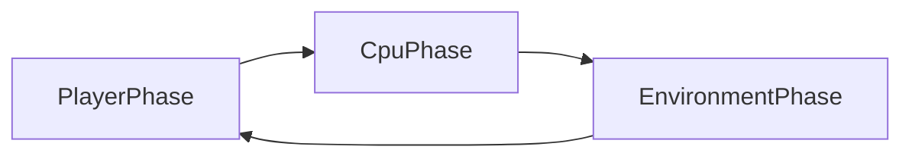

# Board game (vodalus) — product requirements

## 1. Problem and vision

Vodalus needs a **solo tactical board** experience: a small grid, discrete **phased** turns, one human vs one CPU opponent, with an **environmental** layer that creates pressure independent of the enemy. The experience lives as a normal site page at `pages/board.html`, using the same shell as other pages (sidebar, shared styles).

[`indev/board.html`](../../indev/board.html) exists today as **Conway’s Game of Life** to validate that a **large DOM grid** scales and that **addressable cells** are viable in JavaScript. The **shipped game must not resemble Conway**; final boards are **8×8 to 12×12**. Conway code stays **archived** in `indev/` (or an equivalently obvious reference location) for possible future reuse, not as product mechanics.

## 2. User stories

**Authenticated (session cookie present, same identity model as `/api/me`):**

- Start a new procedural game; receive a board with valid starting layout.
- Complete a **player phase**, then observe **CPU** and **environment** phases resolve in order.
- Win by removing the enemy token from the board, or lose when the player token is removed.
- **Stop** and **resume** the same in-progress game on **another device** (server-backed state).
- Optionally abandon a run (no requirement to keep completed-run history for meta progression).

**Not logged in:**

- See login UI with a **guest** option.
- As **guest**: play entirely **client-side**; **no** server persistence, **no** cross-device resume, **no** server-side logging of guest play.

## 3. Core loop (time model)

Each **round** consists of three phases in fixed order: **player → CPU → environment**, then control returns to the player for the next round unless the game has ended.

## 4. Functional requirements

### 4.1 Board and tokens

- Grid dimensions are **procedurally chosen per new game** within **8×8 and 12×12** inclusive.
- Exactly **one player token** and **one enemy token**; both **present on the board** at game start.
- Start positions are on **opposite sides** of the board (exact definition is implementation detail: e.g. opposing edges or hemispheres; PRD requires perceptual “opposite sides” and valid placement).
- **Win**: enemy token **removed** from the board (any supported mechanic).
- **Lose**: player token **removed** from the board.

### 4.2 Phases

1. **Player phase**: human selects legal actions (exact action set TBD under open questions); phase ends when the player commits the turn (or a timeout policy if one is added later; v1 may omit timeout).
2. **CPU phase**: enemy acts using **simple heuristics** (e.g. move toward player, attack if in range, random tie-break). No minimax requirement for v1.
3. **Environment phase**: one or more **environmental / hazard** systems apply in a documented order. **Multiple** such systems are **in scope for v1**; each should be a **named module** with testable rules (land in incremental PRs if needed).

### 4.3 Procedural generation

- Each **new** game (for modes that use the server) gets a layout generated from a **RNG seed** stored in save state so resume is deterministic.
- Generator **must** produce a valid starting state: both tokens on board, opposite-side rule satisfied, and **path sanity** (e.g. a reachable path between player and enemy on walkable tiles unless a deliberate design chooses sealed regions—if so, document as an explicit mode).

### 4.4 Platform

- **Desktop-first** interaction and layout polish.
- **Mobile** must remain **usable** for logged-in users who resume (touch targets, readable grid, no reliance on hover-only affordances for critical actions). Full mobile polish is not required for v1.

### 4.5 Authentication and persistence

- If a valid session exists, **authenticate automatically** (same cookie/session behavior as the rest of the site).
- Persist **in-progress** games **only** for authenticated users, **server-side**, to support **cross-device resume**.
- **No meta progression** across completed games (no persistent unlocks, currency, or profile power carried run-to-run).
- **Guest**: no server save, no resume, no server logging.

## 5. Save model (server)

Persist a **JSON snapshot** sufficient to reconstruct the match. Minimum suggested fields:

| Field | Purpose |
|--------|--------|
| `schemaVersion` | Forward-compatible migrations |
| `rngSeed` | Reproducible proc-gen and hazard noise |
| `boardWidth`, `boardHeight` | Grid size |
| `cells` (or equivalent) | Terrain, hazards, occupancy per cell |
| `playerToken`, `enemyToken` | Positions and any per-token state |
| `phase` | `player` / `cpu` / `environment` (or round boundary state) |
| `roundIndex` | Ordering |
| `hazardState` | Internal counters or queues per hazard module |
| `updatedAt` | Concurrency / housekeeping |

**APIs** (new): authenticated **create**, **read**, **update**, and **delete** (or abandon) of an in-progress game resource, implemented in the Node server (e.g. [`assets/javascript/server.js`](../javascript/server.js)) with SQLite (or existing DB patterns), with auth checks consistent with `/api/me`.

Exact URL shape and table name are implementation details; the PRD requires **one clear resource** per in-progress game unless open questions resolve to “multiple concurrent saves per user.”

## 6. Non-goals (v1)

- Cross-run meta progression (unlocks, shops between runs, profile stat boosts).
- PvP, hotseat, or online multiplayer.
- Realtime WebSocket sync for this mode (REST polling or single-user REST is sufficient unless latency requirements change).
- Conway’s rules, appearance, or tick-based life simulation as **product** behavior.
- Cloud saves or analytics for **guest** sessions.

## 7. Milestones

| Milestone | Deliverable |
|-----------|-------------|
| A | `pages/board.html` shell: grid UI stub, phase indicator, **empty** or stub phase resolution order |
| B | Procedural generator within size bounds + **simple heuristic** CPU |
| C | **First** environmental hazard module wired into `envPhase` |
| D | Additional hazard modules until “multi-hazard v1” acceptance is met |
| E | Server **save/load** + resume UX for logged-in users |
| F | Conway remains only under `indev/` (or documented archive); product path contains no Conway dependency |

## 8. Risks

- **Scope**: multiple environmental systems in v1 can slip schedule; mitigate with modular PRs and a defined “v1 minimum hazard set” checklist.
- **Desktop-first vs resume-on-phone**: risk of poor mobile UX; mitigate with early smoke tests on a narrow viewport.
- **Save schema evolution**: `schemaVersion` and migration strategy required before first public save.

## 9. Open questions

- **Concrete v1 hazard list**: names, ordering, and interaction matrix (e.g. fire vs ice vs tide) — decide before locking acceptance tests.
- **Token removal mechanics**: combat, hazard kill, push off board, or displace-to-void — affects CPU heuristics and generator constraints.
- **Concurrent saves**: may a logged-in user have **multiple** in-progress board games, or exactly one slot?
- **Player action set**: move range, attacks, skills, terrain interaction — drives UI and save shape.
- **End-of-run server behavior**: delete row on win/lose vs keep short TTL for replay/debug (still **no** meta progression).

## 10. Decision log (from design session)

| Area | Choice |
|------|--------|
| Placement | `pages/board.html` with standard vodalus page shell |
| Time model | Phased: player → CPU → environment |
| Players | Solo vs CPU (early milestones) |
| Persistence | No meta across runs; server save for in-progress authenticated games only |
| Conway / indev | Spike only; archive in `indev/`; product grid 8×8–12×12, not CA-based |
| Board content | Procedural per new game |
| Run shape | Single board per save; win/lose ends run |
| Win / lose | Remove enemy token vs lose if player token removed |
| CPU AI | Simple heuristics v1 |
| Environment | Multiple hazard systems in v1 scope |
| Platform | Desktop-first; mobile usable |
| Auth | Session auto-auth; login UI with guest (no server persistence/logging for guest) |
